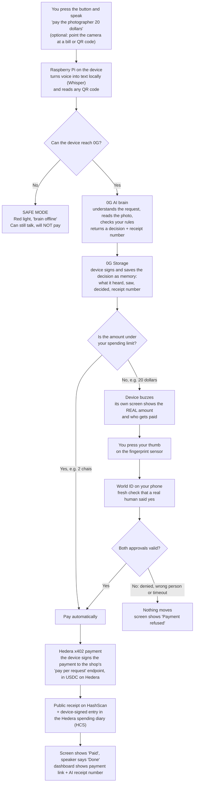

# Leash workflow

```mermaid
flowchart TD
    A["You press the button and speak<br/>'pay the photographer 20 dollars'<br/>(optional: point the camera at a bill or QR code)"] --> B["Raspberry Pi on the device<br/>turns voice into text locally (Whisper)<br/>and reads any QR code"]
    B --> C{"Can the device reach 0G?"}
    C -- "No" --> X["SAFE MODE<br/>Red light, 'brain offline'<br/>Can still talk, will NOT pay"]
    C -- "Yes" --> D["0G AI brain<br/>understands the request, reads the photo,<br/>checks your rules<br/>returns a decision + receipt number"]
    D --> E["0G Storage<br/>device signs and saves the decision as memory:<br/>what it heard, saw, decided, receipt number"]
    E --> F{"Is the amount under<br/>your spending limit?"}
    F -- "Yes, e.g. 2 chais" --> P["Pay automatically"]
    F -- "No, e.g. 20 dollars" --> G["Device buzzes<br/>its own screen shows the REAL amount<br/>and who gets paid"]
    G --> H["You press your thumb<br/>on the fingerprint sensor"]
    H --> I["World ID on your phone<br/>fresh check that a real human said yes"]
    I --> J{"Both approvals valid?"}
    J -- "No: denied, wrong person or timeout" --> Y["Nothing moves<br/>screen shows 'Payment refused'"]
    J -- "Yes" --> P
    P --> K["Hedera x402 payment<br/>the device signs the payment to the shop's<br/>'pay per request' endpoint, in USDC on Hedera"]
    K --> L["Public receipt on HashScan<br/>+ device-signed entry in the Hedera spending diary (HCS)"]
    L --> M["Screen shows 'Paid', speaker says 'Done'<br/>dashboard shows payment link + AI receipt number"]
```

